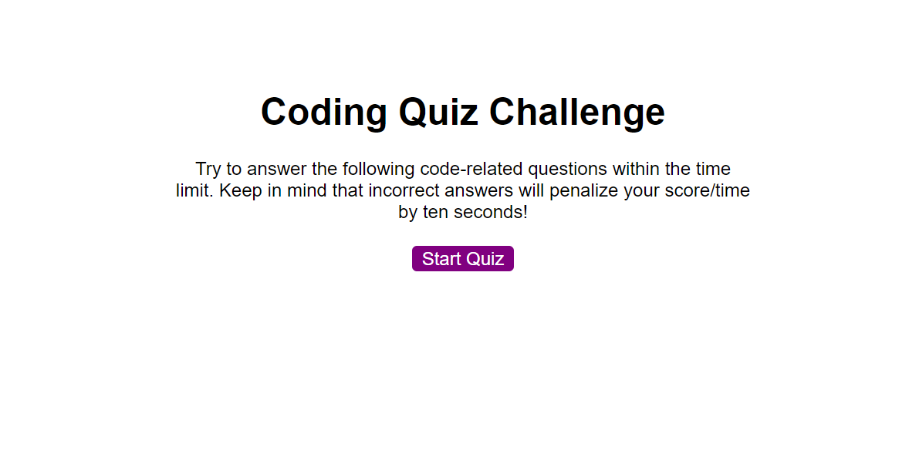
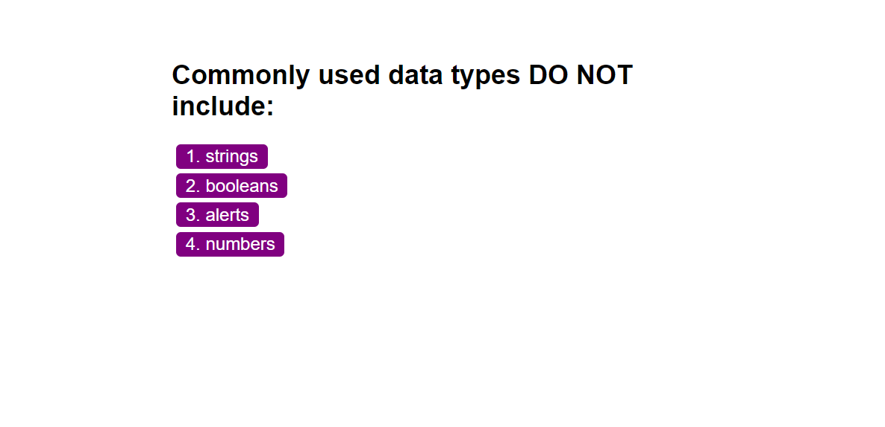

# 04 Web APIs: Code Quiz

## Coding Quiz

This week's homework is to create an interactive web application using vanilla javascript. The application is a timed coding quiz with multiple-choice questions. The app features dynamically updated HTML and CSS.

## User Story

AS A coding boot camp student
I WANT to take a timed quiz on JavaScript fundamentals that stores high scores
SO THAT I can gauge my progress compared to my peers

## How To Play

Click the start button to start the quiz. Answer each question correctly and quickly. If answered incorrectly it will deduct 15 seconds from the timer. The time is your score at the end of the game. 

## Link To Game

https://cloud126.github.io/Code-Quiz/

## Link To Github

https://github.com/Cloud126/Code-Quiz/

## Screenshot

## License

MIT License

Copyright (c) [2020] [Maurino Federico Hernandez]

Permission is hereby granted, free of charge, to any person obtaining a copycd
of this software and associated documentation files (the "Software"), to deal
in the Software without restriction, including without limitation the rights
to use, copy, modify, merge, publish, distribute, sublicense, and/or sell
copies of the Software, and to permit persons to whom the Software is
furnished to do so, subject to the following conditions:

The above copyright notice and this permission notice shall be included in all
copies or substantial portions of the Software.

THE SOFTWARE IS PROVIDED "AS IS", WITHOUT WARRANTY OF ANY KIND, EXPRESS OR
IMPLIED, INCLUDING BUT NOT LIMITED TO THE WARRANTIES OF MERCHANTABILITY,
FITNESS FOR A PARTICULAR PURPOSE AND NONINFRINGEMENT. IN NO EVENT SHALL THE
AUTHORS OR COPYRIGHT HOLDERS BE LIABLE FOR ANY CLAIM, DAMAGES OR OTHER
LIABILITY, WHETHER IN AN ACTION OF CONTRACT, TORT OR OTHERWISE, ARISING FROM,
OUT OF OR IN CONNECTION WITH THE SOFTWARE OR THE USE OR OTHER DEALINGS IN THE
SOFTWARE.